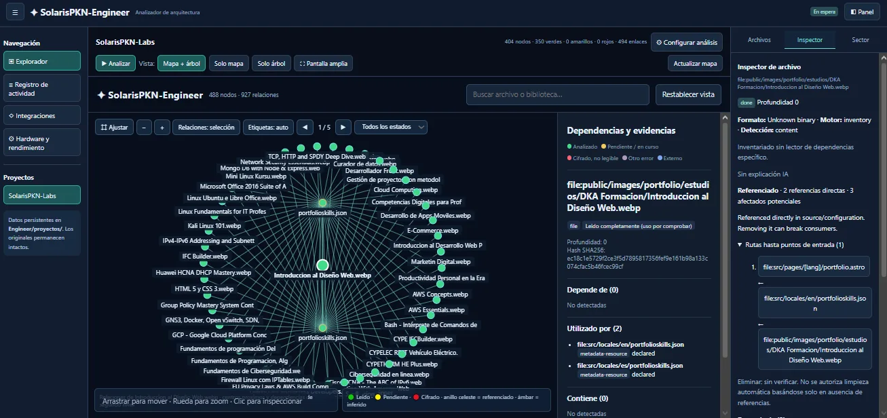
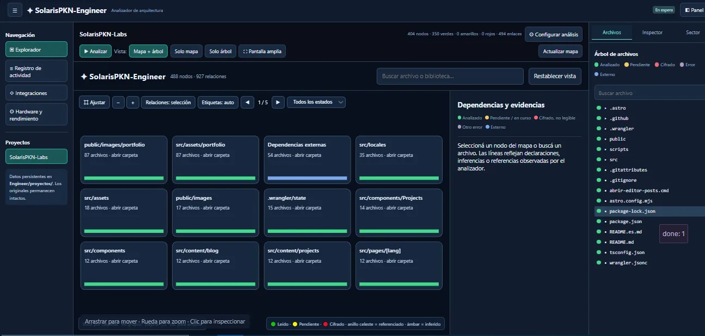
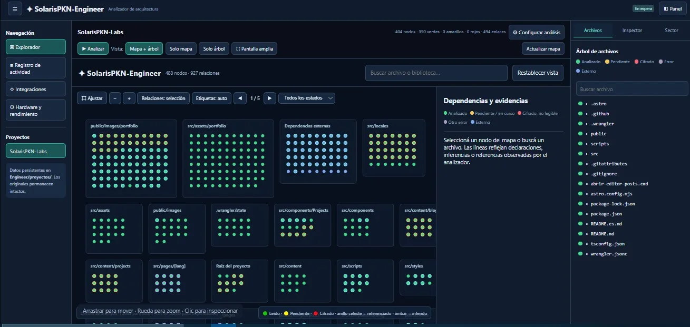

# SolarisPKN-Engineer

**Experimental local dependency and reverse-impact analyzer for source code, binary imports, project assets, and optional AI documentation.**

**English** | [Español](README.es.md)

> **Status:** `v0.1.0-alpha` (experimental). Static parsing can miss runtime-computed references. No inbound links is not proof that a file can be safely deleted. A compiled Windows EXE and interactive tray still require independent validation.

## Screenshots

Explore SolarisPKN-Engineer's dependency graphs, folder navigation, and file inspection. These screenshots show an example analysis of publicly tracked SolarisPKN-Labs files.

### Dependency inspector

### Folder overview

### Folder node map

> **Note:** Screenshots represent an example analysis. Counts and processing status may differ across projects and versions.

## 1. Overview

SolarisPKN-Engineer explores source code and binaries, records which files depend on which others, and builds a navigable graph. It uses an iterative SQLite-backed queue, allowing interruption, restart and limited parallelism without recursive stack growth. It also exports a self-contained HTML graph and an Obsidian-compatible Markdown vault.

An **optional** AI integration reads bounded source excerpts (or binary import metadata), summarizes what each file does, and builds linked documentation indexes. Source inspection is independent of AI availability.

The tool **does not execute inspected binaries, install dependencies or intentionally modify inspected projects**.

## Windows system tray — Open, Restart, Quit

**INICIAR_ENGINEER.cmd** now launches `tray_launcher.py`, a native Windows notification-area application implemented with `ctypes` and the standard Python library. It enforces one tray instance per Windows session.

- **Double-click the tray icon:** open `http://127.0.0.1:8765/`.
- **Right-click → Open panel:** launch the browser.
- **Engine status:** display server activity and whether a project is being processed.
- **Restart Engineer:** request a cooperative checkpointed stop, then start a new Engineer server process.
- **Quit Engineer completely:** stop only the Engineer server (and any Engineer-owned child workers) and remove its notification-area icon.

If analysis is in progress, Engineer requests confirmation before interruption. Completed nodes remain committed in SQLite and interrupted work is resumable. If graceful shutdown exceeds 15 seconds, the tray asks for **separate confirmation** before force-stopping the owned process tree. It never intentionally terminates SolarisPKN-IA, the Solaris Bridge, or unrelated applications.

**Migration note:** when upgrading from an old console-based launch, stop that previous `server.py` first. The tray will not take over an unrelated process already listening on port 8765; close the old instance, then choose Restart in the tray.

**Windows EXE build:** `COMPILAR_EXE.cmd` now packages `tray_launcher.py` as the executable entry point. A compiled EXE has not yet been built/tested on the Windows host. Process errors are logged under `.private/server-process.log`.

## 2. Requirements

- Python **3.10+**; runtime requires only the Python standard library.
- Git on PATH (optional, for file history).
- Modern web browser.
- Ollama or an OpenAI-compatible API (optional, for AI descriptions).
- PyInstaller (optional, for a standalone Windows EXE).

Install by cloning or extracting this repository into any user-writable directory, e.g. `SolarisPKN-Engineer/`. The private Solaris development environment is not required.

### Windows: start the browser application

Double-click **INICIAR_ENGINEER.cmd** or run:

    cd .\SolarisPKN-Engineer
    py -3 tray_launcher.py

To run only the web server without a tray icon:

    py -3 server.py

Open **http://127.0.0.1:8765/**.

Linux/macOS:

    python3 server.py

To disable automatic browser opening:

    python3 server.py --no-browser

The server binds to **127.0.0.1 only**. Do not expose it publicly without additional security engineering.

## Reproducible public SolarisPKN-Labs example

The **`labs_public_example.py`** generator and **`.github/workflows/labs-scan.yml`** use a fresh checkout of the [public SolarisPKN-Labs repository](https://github.com/SolarisPKN/SolarisPKN-Labs). Engineer runs a static scan, then publishes exactly four allowlisted files under `ejemplos/SolarisPKN-Labs/`: `mapa.html`, `mapa.json`, `diagnostico-relaciones.json`, and `README.md`. The example includes only Git-tracked public file names, graph links and status labels—never Labs source content, SQLite indexes, secrets, AI comments or local absolute paths. Automatic publication requires GitHub Actions write permission and fails closed on validation errors.

An example scan illustrates the current static analysis coverage; **it cannot prove that any file is safe to remove**.

## Semantic dependency and directory relationship audit

SolarisPKN-Labs exposed missing links that are now covered by reusable **`project_semantics.py`** rules for future compatible projects:

- Web fonts via CSS `@font-face url(...)` and HTML preload links; HTML, MDX and public image/media references.
- Nested JSON metadata (`heroImage`, `images`, Spanish `imagen`, `portada`, `foto`, etc.), including portfolio certification images.
- Configured Astro/Vite/TypeScript aliases from `astro.config.mjs`, `tsconfig.json` and `jsconfig.json`.
- Literal/template dynamic imports, `import.meta.glob` patterns, and bounded `path.join` path construction, strictly without executing inspected project code. Expanded relationships are labeled **inferred**, not runtime-confirmed.
- Blog post metadata linked to localized MDX content and matching translation files when they actually exist.
- Real filesystem folder hierarchy is exposed as **structural `contains` relationships**, separately from semantic imports. SQLite dependency and impact traversals remain unaffected by directory containment.

Exports also include **`diagnostico-relaciones.json`**, listing incoming semantic-link coverage, possible entry points, unreferenced public resources, and unresolved external references. **Zero incoming edges does not prove a file is unused.**

**To apply this to an existing index:** restart Engineer, select **Reanalyze** and **Entire directory**, then re-export the map. No SQLite deletion is required. The new test module `tests/test_labs_semantic_edges.py` exercises synthetic versions of the audited patterns without executing untrusted project code.

## Redesigned workspace and folder-based graph

The browser application now gives most of its space to the **interactive dependency map**, including on 1360–1366px screens.

- **Collapsible left navigation:** Projects, Activity log, Integrations, Hardware. Logs no longer consume map height.
- **Compact project toolbar:** start analysis directly; expand **Configure analysis** for path, AI, export and refresh options.
- **Right panel with tabs:** Files, Inspector, Scope. These views no longer stack vertically into an excessively long sidebar.
- **View presets:** Map + file tree, Map only, Tree only and Wide map. Press Escape to leave wide map.
- **Folder overview:** nodes are grouped by location with traffic-light status bars; only 6–12 groups appear per page at a readable size. Clicking a folder opens its detailed nodes.
- **Contextual dependency edges:** show local relationships for a selected file by default, with an optional Show All edges mode.
- **Synchronized selection:** a node chosen from the graph opens its details and can be located within the tree.

Solaris's separate screenshot observation system is not part of Engineer: it requires explicit authorization through the Solaris tray and does not automatically upload captures.

## 3. Analyze a project through the browser

1. Enter a full local directory or file path, e.g. C:\Apps\Example\Example.exe.
2. Click **Agregar proyecto / Add project**. An internal project workspace is created **inside Engineer**, leaving the original application untouched.
3. Choose the worker count. Use **1** for minimal resource usage, or 2/4/8/16 for concurrent inspection. Select **Threads** for lower overhead or **Processes** to use multiple CPU cores. The web UI can set the maximum file size from 32 MiB up to 2 GiB.
4. Optionally enable the full-tree scan rather than only the selected entry point.
5. Optionally enable AI commentary and choose its provider, model, endpoint, and language.
6. Start the scan. The application writes progress, errors, file hashes and dependency edges to SQLite.
7. Browse the interactive graph and inspect dependency evidence, AI summaries and reverse-impact paths. A full file-content preview tab is planned for a later release.
8. Regenerate the graph and Markdown documentation after changes.

While the server process remains open, it can run a scan in a local worker thread. When the process exits, work stops, but progress is persisted; starting the scan again continues pending files.

## 4. Per-project internal storage

    SolarisPKN-Engineer/
      engineer.py
      ai_analysis.py
      binary_readers.py
      pe_reader.py
      elf_reader.py
      macho_reader.py
      workspace.py
      server.py
      dashboard_v2.html
      visualizer.html
      export_graph.py
      README.md
      README.es.md
      INICIAR_ENGINEER.cmd
      COMPILAR_EXE.cmd
      tests/
      proyectos/
        example-<stable-id>/
          proyecto.json
          indice.sqlite
          actividad.log
          mapa/
            mapa.json
            mapa.html
            Obsidian/
              Inicio.md
              Indice-IA.md
              Archivos/
                Indice.md
                <individual-file-notes>.md

- **proyecto.json**: original root directory, entry file, creation metadata.
- **indice.sqlite**: deduplicated file nodes, typed edges, states, hashes, and AI notes.
- **actividad.log**: local progress messages and errors.
- **mapa.json**: complete exported nodes, relations and available AI notes.
- **mapa.html**: an independent browser graph with zoom, pan, search, and node details.
- **Obsidian/Archivos**: linked Markdown notes for every indexed node.
- **Obsidian/Indice-IA.md**: global index of AI-generated file explanations.

All files belong to Engineer's internal **proyectos** folder. They are excluded from Git by .gitignore, because analyses may contain confidential paths, names, history and content.

## 5. Progressive graph algorithm

Example: A depends on B and C; B depends on E and F; F depends on H; C depends on H and I.

The engine records A, then discovers B/C, follows pending branches, and records shared dependency H **only once** while preserving both incoming edges. With one worker, deeper discovered nodes are prioritized. Multiple workers process independent pending files concurrently. Cycles do not cause infinite recursion.

The SQLite queue tracks **pending**, **running**, **done**, **failed**, and **external** states. Each file is committed individually, with timestamp, SHA-256, and edges. On restart, unfinished running nodes return to pending. Errors are captured per file and do not stop the rest of the scan.

Source text is initially capped at 4 MiB and any scanned file at 32 MiB by default. External unresolved references are indexed but are **not automatically downloaded or executed**.

Current limitation: incremental analysis is restartable, but automatic full change detection is incomplete; explicitly request **--refresh** to re-index existing files.

## 6. Supported inputs and confidence

| Format | Current inspection | Main limitations |
|---|---|---|
| Python PY/PYI | AST imports and literal references | Runtime-computed names and plugins |
| JavaScript / TypeScript | Literal imports, require and dynamic import strings | Bundler alias / package resolution |
| Astro/MDX/HTML/CSS and related styles | Static component imports, local assets, `@/` and `~/` source aliases | Computed imports, templated paths and bundler transformations |
| C / C++ | Literal include directives | Macros and compiler-specific resolution |
| Java, Kotlin, C#, Go, Rust, PHP, Ruby | Basic syntactic patterns | Not complete semantic parsers |
| npm / pip / Cargo / Go manifests | Initial declared dependency discovery | Lockfiles and exact versions are partial |
| Windows EXE/DLL/SYS/OCX | PE import tables, fallback string hints | Dynamic loads, packing, obfuscation |
| Linux ELF binaries | DT_NEEDED for supported layouts | dlopen and advanced layouts |
| macOS Mach-O | Thin binary library load commands | Universal/fat binaries and advanced variants |

For a binary import name matching another local library, the engine can follow that file recursively. Names not resolved inside the project are recorded as external dependencies.

**Declared** references and **heuristic** string matches are distinct evidence levels. A declared import is not proof that the dependency is essential. A string in a binary is not proof that it loads a library. Binary inspection never runs the target application.

## 7. Optional per-file AI explanations

AI does **not** discover or certify graph edges: it produces a separate interpretive documentation layer.

Default local configuration:

    Provider: ollama
    Endpoint: http://127.0.0.1:11435/api/chat
    Model: qwen2.5-coder:7b
    Language: es (English: en)

Each request contains bounded source text and already discovered static references. For binary files, the model receives import metadata only, **not decompiled source**.

Expected structured output:
- Short file purpose.
- Main responsibilities.
- Important symbols.
- Inputs and outputs.
- Technical notes.
- Limitations and uncertainty.

Each explanation is persisted in SQLite, cached by **source SHA-256 + model configuration + prompt version**, and exported to the Markdown file, **Indice-IA.md**, the JSON graph and HTML inspector. If the AI endpoint is unavailable, mechanical graph indexing remains intact. Failed AI notes can be retried.

Model output is labeled **unverified AI commentary**, not a tested fact.

### Remote AI providers

Select provider **openai**, provide an OpenAI-compatible HTTPS chat completion endpoint and model, and explicitly enable **remote AI transfer**. Set credentials through the **ENGINEER_AI_API_KEY** environment variable; never place API keys in project files or exported maps.

Only send source you are authorized to disclose. Pattern-based secret filtering is a limited safeguard, not a guarantee that sensitive content will be removed. Use local AI or disable AI for confidential programs.

Instructions found inside source files are treated as untrusted data.

## 8. Command-line interface

Scan an entry-point source file:

    py -3 engineer.py scan "C:\MyProject" --entry main.py --db .\datos\my-project.sqlite --workers 1

Scan a Windows executable:

    py -3 engineer.py scan "C:\MyApp" --entry MyApp.exe --db .\datos\app.sqlite --workers 4

Scan every recognized file in a tree:

    py -3 engineer.py scan "C:\MyProject" --all --db .\datos\my-project.sqlite --workers 4

Scan and request AI commentary:

    py -3 engineer.py scan "C:\MyProject" --entry main.py --db .\datos\my-project.sqlite --ai

Resume AI commentary or retry failures:

    py -3 engineer.py annotate --db .\datos\my-project.sqlite
    py -3 engineer.py annotate --db .\datos\my-project.sqlite --ai-retry-failed

Export, inspect statistics, inspect Git history:

    py -3 engineer.py export --db .\datos\my-project.sqlite --output .\salida
    py -3 engineer.py stats --db .\datos\my-project.sqlite
    py -3 engineer.py history "C:\MyProject" main.py

The web UI creates and manages project workspace paths automatically; the CLI uses the database/output paths you explicitly supply.

## 9. Build a standalone Windows EXE

PyInstaller is optional. To build:

    py -3 -m pip install pyinstaller
    COMPILAR_EXE.cmd

The build script requests a single **SolarisPKN-Engineer.exe** in the same directory as the application's source. Opening it starts the local HTTP server and a browser tab. Project workspaces remain alongside the executable under **proyectos**.

This is a browser-based application packaged as a Windows process; the EXE does not replace its interactive HTML UI.

**Current status:** the build script exists, but the executable has **not yet been compiled and verified** on the host. Run it from a directory writable by your account.

## Encrypted credential vault (Windows DPAPI)

SolarisPKN-Engineer can **optionally remember** archive passwords, AI provider API keys, and a GitHub token. Credentials are protected with **Windows DPAPI (CryptProtectData, current-user scope)** and stored in `.private/credentials.dpapi.json` under the Engineer application directory. The file contains ciphertext blobs, opaque hashed identifiers, and timestamps; `.private/` is excluded from Git.

For a ZIP, select **Remember encrypted for my Windows account**, **Use saved password**, or **Delete saved password** from the file inspector. A newly provided password is saved only after the application successfully decrypts at least one genuinely encrypted ZIP entry, with no remaining decryption errors. Secret values are never returned to the browser.

In **Integrations**, users can save/delete encrypted API keys for configured AI providers and a GitHub token. If an environment variable is configured, that credential takes precedence; otherwise the application looks in the encrypted vault. The browser can check whether a credential is available but cannot retrieve its value.

**Security and recovery:**
- The DPAPI vault is tied to the Windows account/profile that created it. Copying the encrypted file alone to another device/account is not enough for recovery; keep separate backups of original credentials in your own password manager.
- Credentials are temporarily decrypted in the local application's memory during authorized operations. Malware running within your Windows session may still access secrets.
- No password guessing, plaintext fallback, or writing keys to Obsidian, exported dependency graphs or application logs.
- Saving credentials is explicitly disabled on operating systems without the Windows DPAPI backend.
- Deleting a vault entry does not guarantee secure erasure from disk snapshots, backups, or transient memory.
- Provider credentials are sent over HTTPS when making an authorized remote API call. Source content is sent to remote AI only with explicit opt-in.

## Owner-authorized unlocking of encrypted files

For a red (encrypted) file, its owner or another authorized person can choose a method in the inspector:

- **ZIP password (ZipCrypto):** enter a ZIP password and confirm authorization. Engineer streams archive members without extracting source code to the original project or persisting a decrypted copy. Each readable member is represented in the dependency graph; members that cannot be read remain red. Passwords are saved only if the user opts in, encrypted with DPAPI after successful decryption.
- **Already-decrypted owner-provided copy:** for other encryption schemes, the user can run their own trusted decryption application and provide the resulting file or directory. Engineer registers a separate project and records a user-declared provenance link. The new project still needs to be scanned; this does not imply native support for the encryption algorithm.

**Limitations:** Python ZipFile supports traditional ZipCrypto, not WinZip AES. Passwords are never stored in plaintext; optionally saved passwords are protected by Windows DPAPI. Member filenames and discovered dependency edges are still persisted. Very large archives may still require significant resources and advanced formats need specialized adapters.

## Reverse usage and impact analyzer

**Read successfully does not mean used, and no detected import does not mean safe to delete.** Green/yellow/red dots still indicate analysis progress. Cyan outlines show declared inbound references, amber outlines inferred inbound references, and purple outlines potential entrypoints. A missing outline has no deletion-safety implication.

Selecting a file now opens a **two-level relationship neighborhood** and a **Usage and impact** inspector. The reverse analyzer follows incoming consumer links, including multi-hop paths to route/script/configuration entrypoints; it labels direct declared versus inferred evidence and limits potentially huge graph traversals. The UI keeps consumers distinct from **`generates`** producer provenance.

For SolarisPKN-Labs, the post creator can produce existing MDX/JSON/image/locale files; a post's `post.json` references its actual `heroImage` and gallery; dynamic Astro routes consume post metadata. This reconstructs navigable relationships from a post image to its corresponding page. Static `settings.json` reads and npm package manifest dependencies are also identified when declared in source.

**Deletion safety is intentionally unverified** (the API returns `safe_to_delete: null`). Unreferenced means only not found under the installed parsers. For OS-level analysis, package ownership, boot chain, drivers/modules, services, scheduled tasks, runtime loads, external callers and integration tests are essential. Never automatically delete supposedly obsolete OS files based only on a static graph; verify through isolated snapshots/VMs and monitored execution first.

Use `GET /api/impact?project=ID&key=file:PATH` or the UI inspector. Regression fixtures are in `tests/test_impact_usage.py`. Restart Engineer and select **Reanalyze** to update existing indexes.

## Traffic-light colors in the graph and file tree

- **Green**: file scanning completed (`done`). It does not guarantee complete understanding of the file.
- **Yellow**: file queued or currently scanning (`pending` / `running`).
- **Red**: recognized encryption evidence prevents content analysis (`encrypted`), with the reason shown in the inspector. High entropy, unknown extensions, or ordinary errors are not sufficient evidence.
- **Purple/gray**: other inspection failures (`failed`), including unsupported or corrupt formats.
- **Blue**: unresolved external dependency (`external`).

Directories aggregate descendant statuses: red means at least one indexed descendant was detected as encrypted. The browser graph can refresh status colors during an ongoing scan from a bounded SQLite snapshot. Explicit refresh permits reattempting previously encrypted files.

## 10. Security, scalability, and limitations

- Read-only inspection of the selected original directory, no binary execution.
- Localhost web server with Host validation and ephemeral POST token.
- One background scan/annotation/export job per running server, multiple workers per scan.
- SQLite prevents repeat work after interruptions and preserves partial progress.
- Disk, RAM, CPU and source file limits still apply.
- The graph canvas currently renders at most ~2,200 nodes simultaneously; all are exported to JSON and Markdown. Massive graphs need optimized streaming exports and clustered rendering.
- No deep decompilation, ETW tracing, runtime plugin observation, package download, full function call graphs or Git timeline edges yet.
- Git history is available on demand for files inside a Git checkout.
- API credentials can be stored as environment variables or in the encrypted Windows DPAPI vault; never commit private maps, credentials or source excerpts.
- GitHub per-file access control is intentionally out of scope.

## Preparing the first commit (v0.1.0-alpha)

Run **`PREPARAR_GITHUB.cmd`** in the original development folder. It executes the unittest suite first and, on success, stages allowlisted source and tests at `dist/github-export/SolarisPKN-Engineer`. When the local Labs scan and public Git tree manifest are available, it can also add a sanitized scan example. It never copies the Labs source, DPAPI vault, internal databases or private logs. Review the SHA256 manifest before publishing. The helper itself does not commit or push. Full content preview is planned for a later release.

## GitHub publication checklist

Run **VERIFICAR_REPO.cmd** from the independent Engineer directory and review **RELEASE_CHECKLIST.md**. Keep internal project indexes, `.private/`, credentials, logs and unreviewed screenshots out of Git. The existing public repository is licensed **GNU AGPL-3.0**; retain its `LICENSE` file. Building and testing the optional Windows EXE is a separate release step.

## 11. Tests and diagnostics

Run:

    py -3 -m unittest discover -s tests -v

Test files define coverage for recursion, shared nodes, cycles, worker concurrency, recovery, refresh, exporter output, local workspace isolation, AI cache, simulated offline responses and basic sensitive-file filters.

See each project's **actividad.log** for failures. Check the AI URL and installed model if annotations fail.

**Verification caveat:** these tests are authored but have not yet been confirmed to pass on the original Windows host.

## 12. Future roadmap

Stronger parser/resolver plugins, automatic hash refresh, dependency lockfile support, secure package retrieval, sandboxed runtime observation, Git history edges, large-graph clustering, detailed functions/classes analysis, configurable resource budgets, and a tested Windows binary distribution.

---

This repository publishes **Engineer only** plus sanitized public examples. Never synchronize the private Solaris host tree. Repository license: **GNU AGPL-3.0**.
